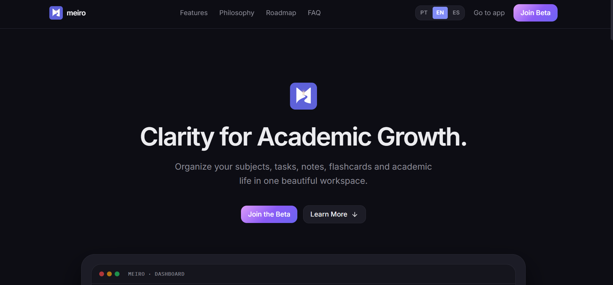
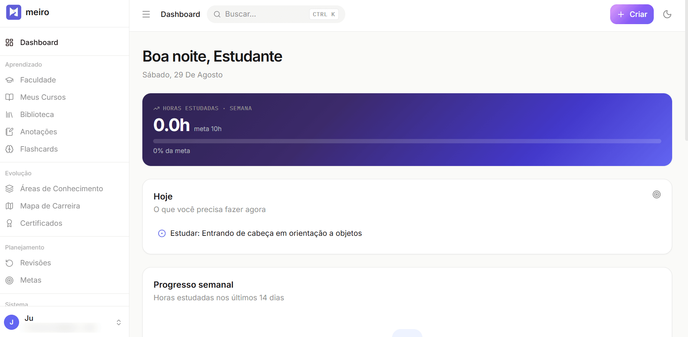
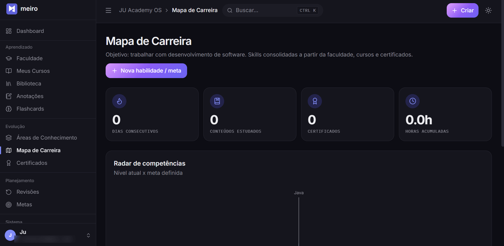
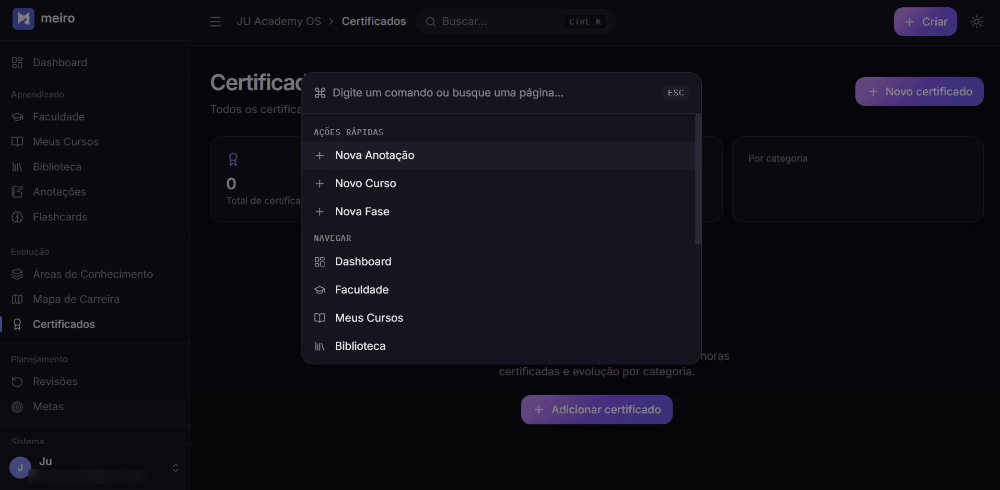
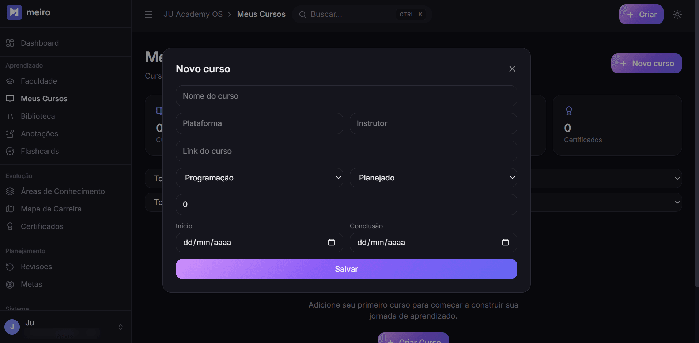

<div align="center">


# Meiro

**Do labirinto à clareza.** O sistema operacional dos seus estudos.

[withmeiro.xyz](https://withmeiro.xyz) · beta fechado, por convite

</div>

---

## Telas

<p align="center">
  <br />
  <sub><b>Landing</b> — apresentação pública em withmeiro.xyz, com captura de lista de espera e conteúdo em português, inglês e espanhol.</sub>
</p>

<table>
<tr>
<td width="50%"><br /><sub><b>Dashboard</b> — o dia em uma tela: horas da semana, o que fazer agora e progresso. Tema claro.</sub></td>
<td width="50%"><br /><sub><b>Mapa de Carreira</b> — radar de competências alimentado por faculdade, cursos e certificados.</sub></td>
</tr>
<tr>
<td><br /><sub><b>Command palette</b> (Ctrl K) — navegação e ações rápidas em qualquer tela.</sub></td>
<td><br /><sub><b>Cadastro de curso</b> — formulários em modal, sem tirar a pessoa do contexto.</sub></td>
</tr>
</table>

## O problema

Estudante de graduação organiza a vida acadêmica em cinco lugares ao mesmo tempo:
Notion pras matérias, o calendário pros prazos, um app de tarefas, outro de
flashcards e o caderno pras anotações. Nada conversa entre si, e manter tudo
sincronizado vira um trabalho paralelo ao de estudar.

O Meiro junta faculdade, cursos, biblioteca, anotações, flashcards, revisão
espaçada, metas e mapa de carreira em um só lugar — com um dashboard que responde
uma pergunta só: **o que eu preciso fazer agora?**

## Stack

| Camada | Escolha |
| --- | --- |
| Front-end | React 19, TypeScript, Vite 8 |
| Estilo | Tailwind CSS 4 |
| Estado | Zustand |
| Rotas | React Router 7 |
| Gráficos | Recharts |
| Animação | Framer Motion |
| Back-end | Supabase — Postgres, Auth, Storage, Edge Functions (Deno) |
| PWA | vite-plugin-pwa (offline shell, instalável) |

17 páginas, 28 componentes, 16 tabelas no Postgres.

## Decisões técnicas

As partes do projeto que valem uma conversa:

**Segurança no banco, não no front.** Cada uma das 14 tabelas de conteúdo tem
`user_id` e RLS com quatro policies (`select`/`insert`/`update`/`delete`), todas
comparando com `auth.uid()`. O `update` usa `USING` **e** `WITH CHECK` — sem o
segundo, um usuário poderia reatribuir uma linha sua para outra conta. O front
nunca é a fronteira de segurança: esconder um botão é UX, quem barra o acesso é
o Postgres.

**Área administrativa com privilégio real.** A lista de espera é visível apenas
para quem está na tabela `admins`, checada por uma função `SECURITY DEFINER`.
A tabela não tem policy de escrita — só a service role promove alguém, então não
existe caminho de auto-promoção pela aplicação.

**A service role key nunca chega ao navegador.** O convite de novos usuários roda
numa Edge Function que valida se quem chama é admin, confirma que o e-mail está
na lista de espera e só então usa a chave privilegiada. CORS restrito à origem
do app.

**Camada de serviço agnóstica de back-end.** O CRUD é uma fábrica genérica
(`createSupabaseCrudService<T>`) com a mesma assinatura que a implementação
anterior em IndexedDB/Dexie. A migração de banco local para Supabase não exigiu
tocar em nenhuma página — só trocar a implementação por trás da interface.

**Cadastro só por convite, de verdade.** A primeira versão checava a aprovação no
navegador antes de criar a conta. Isso não protege nada: a anon key é pública e
qualquer um chama o endpoint de signup direto. A versão atual desliga o cadastro
público no Supabase e libera acesso exclusivamente por convite emitido pela
Edge Function.

**"Professor Particular IA" sem API de IA.** O recurso monta um prompt
estruturado a partir do material da aula para a pessoa colar no ChatGPT, Claude
ou Gemini que já usa. Foi decisão consciente: zero custo de inferência, zero
chave de terceiro para vazar, e o usuário escolhe o modelo. Vale a pena integrar
uma API de verdade quando houver receita que pague por isso.

## Arquitetura

```
Navegador (SPA React + PWA)
  │
  ├── supabase-js  ──────►  Postgres         cada request carrega o JWT;
  │                                          RLS decide o que a pessoa vê
  ├── supabase-js  ──────►  Storage          bucket privado, particionado
  │                                          por user_id, URL assinada
  └── functions.invoke ──►  Edge Function    única parte com service role;
                            (Deno)           valida admin antes de agir
```

## Rodando localmente

```bash
npm install
cp .env.example .env.local   # preencha com os dados do seu projeto Supabase
npm run dev
```

| Variável | Onde encontrar |
| --- | --- |
| `VITE_SUPABASE_URL` | Supabase → Project Settings → API |
| `VITE_SUPABASE_ANON_KEY` | Supabase → Project Settings → API (chave pública) |

> Nada de `service_role key` em variável `VITE_*` — tudo que começa com `VITE_`
> entra no bundle e fica visível no navegador.

### Banco

Projeto novo: rode `supabase/schema.sql` no SQL Editor.
Projeto existente: rode `supabase/migrations/0001_hardening_admin_rls.sql`.

Depois, desative *"Allow new users to sign up"* em Authentication → Sign In /
Providers, e promova sua conta a admin:

```sql
insert into admins (user_id) values ('SEU-USER-UUID');
```

### Edge Function

```bash
supabase secrets set ALLOWED_ORIGIN=https://seu-dominio.com
supabase functions deploy invite-user
```

## Estrutura

```
src/
  components/   ui/ (design system), common/, landing/, cursos/, faculdade/
  hooks/        useLiveData, useSupabaseTable
  layout/       AppLayout, Sidebar, Header, ProtectedRoute, AdminRoute, HomeGate
  lib/          supabaseClient, markdown, promptGenerator, caseConvert, dataBus
  pages/        17 telas
  services/     CRUD genérico + storage de arquivos
  store/        Zustand (auth, ui)
supabase/
  schema.sql    tabelas, policies, triggers, bucket
  migrations/   correções aplicáveis a um banco já existente
  functions/    invite-user (Deno)
```

## Roteiro

- [x] Beta fechado por convite
- [ ] Lançamento público
- [ ] App mobile
- [ ] Assistente de IA integrado (v2)

## Licença

Proprietário — todos os direitos reservados. O código está público para leitura e
avaliação; nenhum uso, cópia ou redistribuição é autorizado. Ver [LICENSE](LICENSE).
